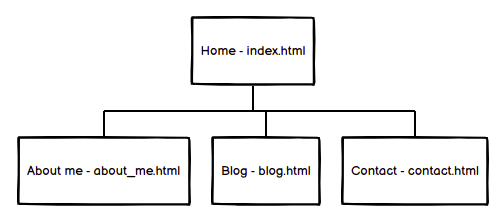
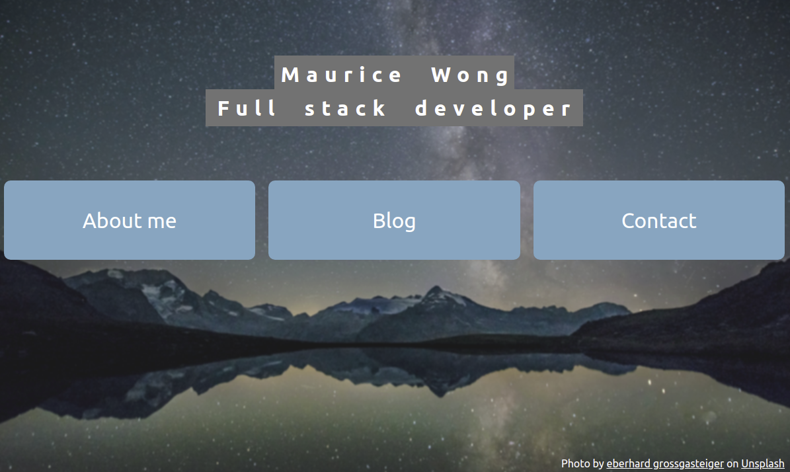
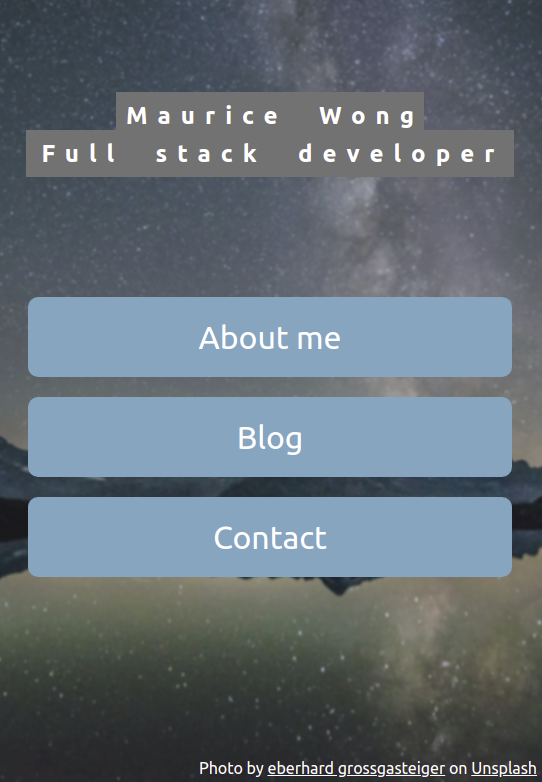
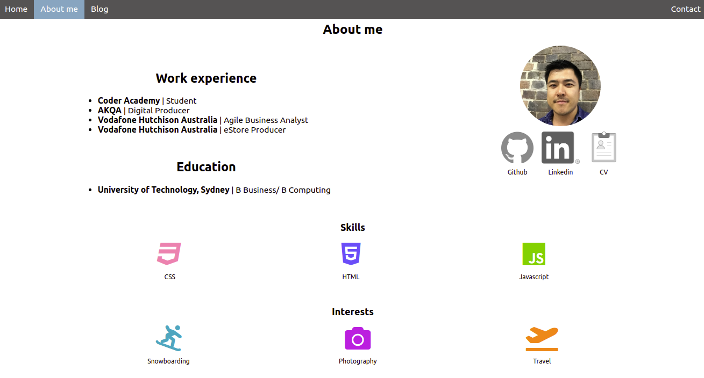
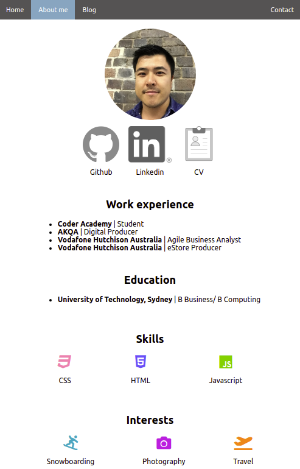
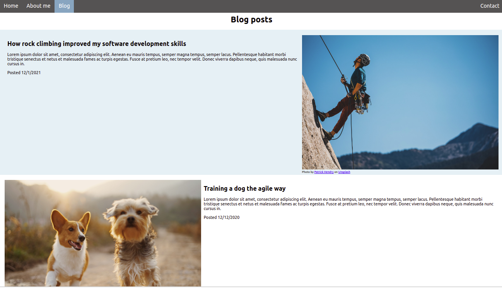
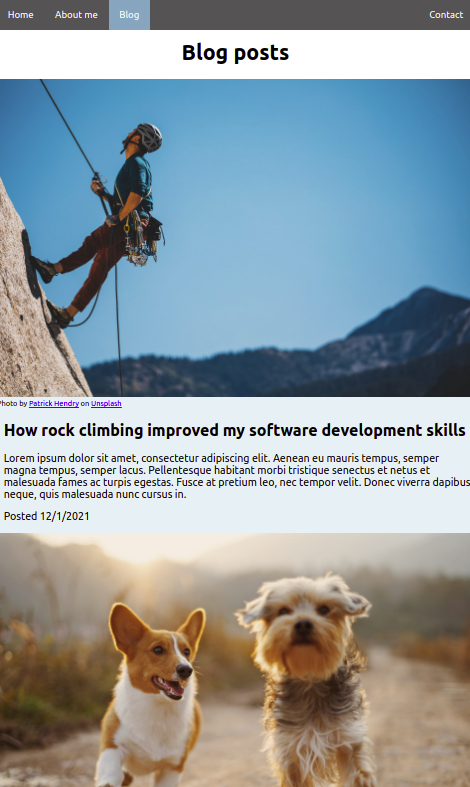
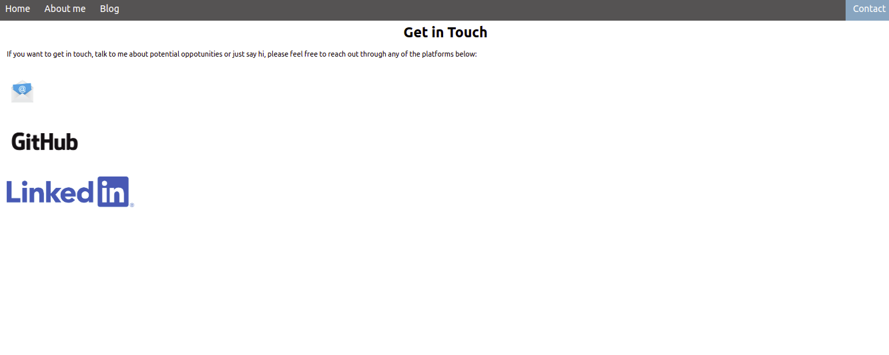
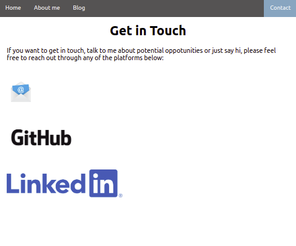

# T1A2 Portfolio - Maurice Wong
## Portfolio website URL

Website: [Here](https://mauricepwong.github.io/Portfolio/src/index.html)

Github: [Here](https://github.com/Mauricepwong/Portfolio)

## Description
### Purpose
The purpose of this website is to showcase to potential employees the skills I have learnt as a developer. It will be a resume of sorts showing them my work/education history, skills and interests I might have, as well as a link to my CV. It will also include social links if potential employers want to contact me. 

### Functionality / features
#### Homepage animations 

#### Navigation Bar

#### Responsive design

#### Social link highlights 

#### Blog Listings 

#### Theme
##### Colour Palette
##### Typography 

#### Figcaption

#### W3C Validation

#### Accessibiliy 

### Sitemap and wireframes 

### Screenshots

### Target audience
The target audience for the website are:
- Potential employers 
- Student and staff at Coder Academy

### Tech stack
- Visual Studio Code - Code editor used 
    - Prettier
    - Live Server
    - Markdown Preview
- HTML - to structure the pages of the website
- CSS - to style and postion the elements on the website 
- Font awesome - Icons for the website
- [Upsplash](https://unsplash.com/) - Images for the website
- Github - For web hosting
- Balsamiq - to create the wireframes and sitemap
- [siteimprove](https://siteimprove.com/) - to check accessibility of the site 
- [W3C](https://validator.w3.org/) - to ensure the correct HTML has been implemented
- [colormind]http://colormind.io/ - to help keep colour theme consistent