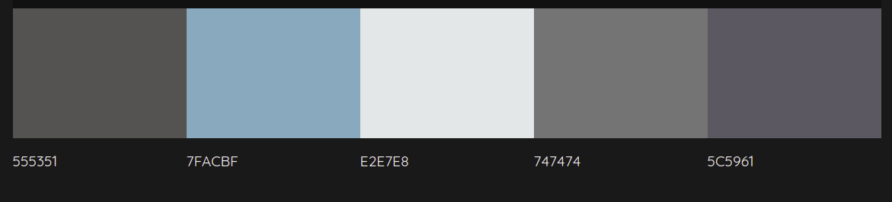
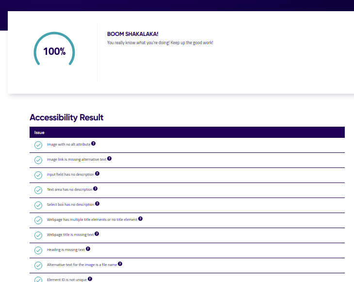
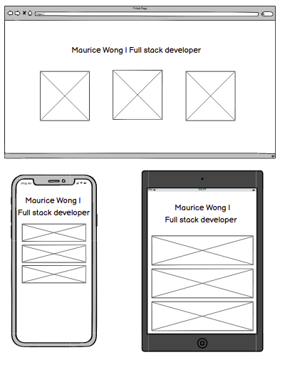
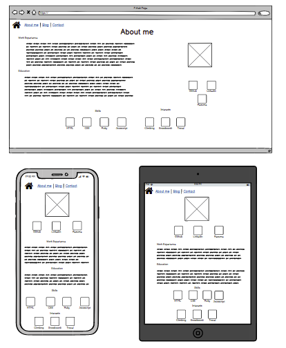
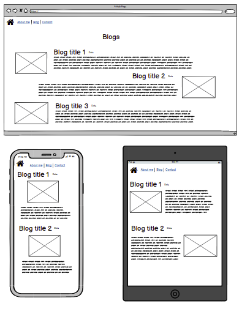
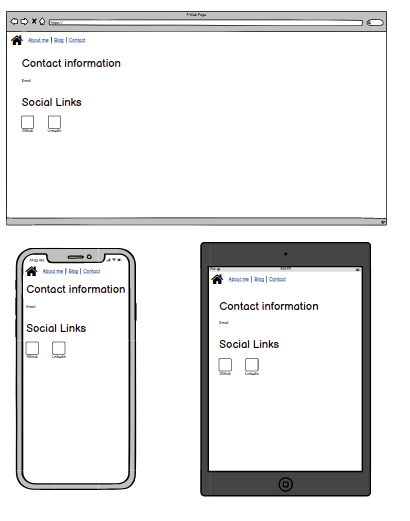

# T1A2 Portfolio - Maurice Wong
## Portfolio website URL

Website: [Here](https://mauricepwong.github.io/Portfolio/src/index.html)

Github: [Here](https://github.com/Mauricepwong/Portfolio)

## Description
### Purpose
The purpose of this website is to showcase to potential employees the skills I have learnt as a developer. It will be a resume of sorts showing them my work/education history, skills and interests I might have, as well as a link to my CV. It will also include social links if potential employers want to contact me. 

### Functionality / features
#### Homepage animations 
Animations has been built into the homepage so that it is more interactive and encouraging users to click further into the site. The buttons change colour and have a zoom affect applied to them.  

#### Sticky Navigation Bar
This will allow users to navigate the website. The nav will remain at the top of the users screen to give them access to the other pages without having to scroll back up. Other features built in: on hover the nav item highlights so they know which page they are selecting, highlight of the current page they are on, disabling the link to the current page as well.  

#### Responsive design
User will be visiting the site on various devices of different screen size. To ensure the site looks good on all screens I utilised flexbox and media breakpoints adjusting the design as needed.   

#### Social link highlights 
The social buttons highlight to signify to the users that they can interact with them

#### Icons
I used icons in my about me page. It a quick way to notify users what my skills and interest are without the use of long paragaphs. 

#### Blog 
The blog page by itself could be quite word heavy so I decided to add images and alternated thoses images to ensure the attention of the user isnt lost.

#### Theme

Consistent styling was achieved by using a colour pallette and the same font family for all the pages. 

#### Figcaption
These were used to give credit to the author of the images I used. 

#### Accessibiliy 

Accessibility was always kept in mind. There was alt texted used when needed, high contracts between background and text. I also ran the site through an accessibility checker which came back 100%. 

### Sitemap and wireframes 

### Screenshots

### Target audience
The target audience for the website are:
- Potential employers 
- Student and staff at Coder Academy

### Tech stack
- Visual Studio Code - Code editor used 
    - Prettier
    - Live Server
    - Markdown Preview
- HTML - to structure the pages of the website
- CSS - to style and postion the elements on the website 
- Font awesome - Icons for the website
- [Upsplash](https://unsplash.com/) - Images for the website
- Github - For web hosting
- Balsamiq - to create the wireframes and sitemap
- [siteimprove](https://siteimprove.com/) - to check accessibility of the site 
- [colormind](http://colormind.io/) - to help keep colour theme consistent